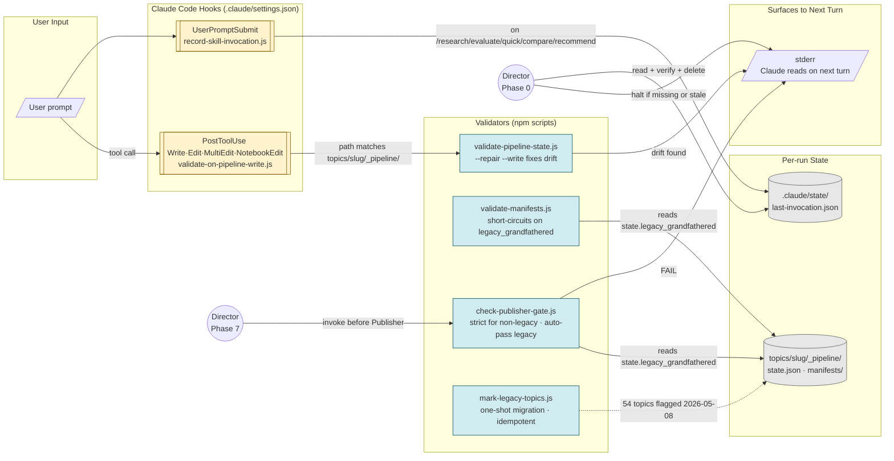
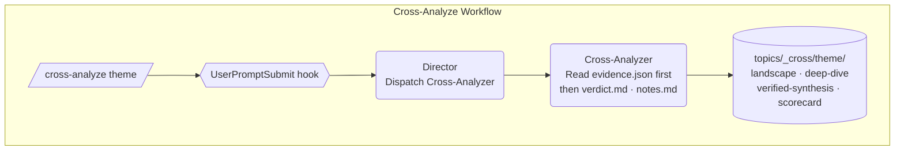

# BrainStorming — Architecture Diagram

Multi-phase research pipeline: slash-command invocation → invocation guardrail → 11-phase Director-orchestrated pipeline → pre-publish gate → published topic files. Reliability hooks watch state drift on every `_pipeline/` write.

---

## Pipeline Flowchart

```mermaid
flowchart TD
    USER[/User types slash command\n/research · /quick · /compare · /evaluate · /recommend/]
    UPS{{UserPromptSubmit hook\nrecord-skill-invocation.js}}
    TOKEN[(.claude/state/last-invocation.json\nsingle-use, 30 min TTL)]

    USER --> UPS --> TOKEN

    subgraph P0["Phase 0 — Intake & Classification"]
        GUARD{Token present\n+ workflow match\n+ within 30 min?}
        HALT[/HALT\nNot invoked via slash command —\nrefuse to start/]
        DIR(Director\nParse · Classify · Slug\nRelated-Topics Lookup · Mode\nFraming Gate · state.json\nlegacy_grandfathered: false)
        GUARD -->|no| HALT
        GUARD -->|yes — consume token| DIR
    end

    TOKEN --> GUARD

    subgraph P1["Phase 1 — Parallel Research"]
        RES(Researcher\nLandscape Brief)
        INV(Investigator\nAdversarial Brief)
        GAPQ{Critical\nGaps?}
        GF(Gap-Fill\nTargeted Search)
        BRIEFS[(landscape.md\ndeep-dive.md)]
        RES --> GAPQ
        INV --> GAPQ
        GAPQ -->|yes — Phase 1b| GF --> BRIEFS
        GAPQ -->|no| BRIEFS
    end

    subgraph P2["Phase 2 — Analysis"]
        ANA(Analyzer\nCross-Reference · Confidence Ratings)
        SYNTH[(verified-synthesis.md\nevidence.json)]
        ANA --> SYNTH
    end

    subgraph P34["Phase 3–4 — Draft & Quality Gate"]
        WRI(Writer\nDraft overview · notes · verdict)
        DRAFTS[(draft-overview\ndraft-notes · draft-verdict)]
        CRI(Critic\n8-Dimension Rubric)
        CGATE{Verdict?}
        WRI --> DRAFTS --> CRI --> CGATE
        CGATE -->|"REVISE 6.0–7.9\nmax 3 cycles"| WRI
    end

    SECQ{Security\nRequired?}

    subgraph P56["Phase 5–6 — Security Review + Stress Test (parallel when both required)"]
        SR(Security Reviewer\nAudit Risks · Compliance)
        SGATE{Security\nVerdict?}
        SBLOCK[/BLOCK — Halt\nReport to User/]
        TST(Tester\n≥ 12 Real-World Scenarios)
        TGATE{Tester\nVerdict?}
        SR --> SGATE
        SGATE -->|BLOCK| SBLOCK
        TST --> TGATE
    end

    subgraph P65["Phase 6.5 — Adversarial Challenge"]
        CHL(Challenger\nMin 8 Search Queries)
        CHGATE{Verdict?}
        CHL --> CHGATE
    end

    subgraph P7["Phase 7 — Pre-Publish Gate + Publisher"]
        GATE{{check-publisher-gate.js\nrequired manifests · drafts\nweighted_total ≥ 8.0\nrun_metrics not all zero\nchallenger search_count ≥ 8}}
        GFAIL[/FAIL — fix manifests,\nrepair metrics, or set\nstate.quality_gate_exception/]
        PUB(Publisher\nFinalize · Style · Index Update)
        OUT[(overview.md · notes.md\nverdict.md · index.md\nphase-7-publisher.json\npublication.json)]
        GATE -->|FAIL| GFAIL --> GATE
        GATE -->|"PASS / legacy auto-pass"| PUB
        PUB --> OUT
    end

    DONE[/Delivery\ntopics/slug · Verdict · Score · Confidence/]

    DIR --> RES & INV
    BRIEFS --> ANA
    SYNTH --> WRI
    CGATE -->|"REWRITE < 6.0"| ANA
    CGATE -->|"PASS ≥ 8.0"| SECQ
    SECQ -->|"yes — parallel spawn"| SR & TST
    SECQ -->|no| TST
    SGATE -->|FLAG — revise| WRI
    SGATE -->|PASS| TGATE
    TGATE -->|FAIL — revise| WRI
    TGATE -->|"PASS / COND"| CHL
    CHGATE -->|"STANDS / NOTED"| GATE
    CHGATE -->|WEAKENED — qualify claims| WRI
    CHGATE -->|SUSTAINED — new evidence| ANA
    OUT --> DONE
```



---

## Reliability Layer

Two hooks and a one-shot migration enforce integrity around the pipeline. Wired in `.claude/settings.json`. See `docs/reliability/IMPLEMENTATION_STATUS.md` for the live behavior contract.



---

## Cross-Analyze Workflow

Separate from the research pipeline — no web research. Synthesizes patterns across all existing topic files and writes to `topics/_cross/`. Cross-analysis bypasses the publisher gate (its output is not a topic).



---

## Agent Handoff — Happy Path

Standard research run showing the turn-by-turn sequence (no revisions, no security block, no gate failures).

```mermaid
sequenceDiagram
    participant U  as User
    participant H  as UserPromptSubmit\nHook
    participant TK as Token File
    participant D  as Director
    participant RE as Researcher
    participant IN as Investigator
    participant AN as Analyzer
    participant WR as Writer
    participant CR as Critic
    participant SR as Security Reviewer
    participant TE as Tester
    participant CH as Challenger
    participant G  as Publisher Gate
    participant PB as Publisher

    U->>H: /research [topic]
    H->>TK: write last-invocation.json
    H-->>D: prompt continues to model
    D->>TK: read + verify + delete
    note over D: Phase 0 — guardrail PASS;\nstate.json with\nlegacy_grandfathered: false
    par Phase 1 — parallel spawn
        D->>RE: landscape research
        D->>IN: adversarial deep-dive
    end
    RE-->>D: landscape.md
    IN-->>D: deep-dive.md
    note over D: Phase 1b — gap assessment (skip if minor)
    D->>AN: Phase 2 — analyze + synthesize
    AN-->>D: verified-synthesis.md + evidence.json
    D->>WR: Phase 3 — draft
    WR-->>D: draft-overview · notes · verdict
    D->>CR: Phase 4 — quality gate
    CR-->>D: scorecard.md  PASS ≥ 8.0
    par Phase 5+6 — parallel when security required
        D->>SR: Phase 5 — audit recommendations
        D->>TE: Phase 6 — stress test
    end
    SR-->>D: security-review.md  PASS
    TE-->>D: stress-test.md  PASS / COND
    D->>CH: Phase 6.5 — adversarial challenge
    CH-->>D: challenge.md  STANDS
    D->>G: npm run check-publisher-gate
    G-->>D: PASS — manifests · drafts · score · metrics OK
    D->>PB: Phase 7 — publish
    PB-->>D: overview.md · notes.md · verdict.md
    D-->>U: topics/slug/ — verdict · score · confidence
```
