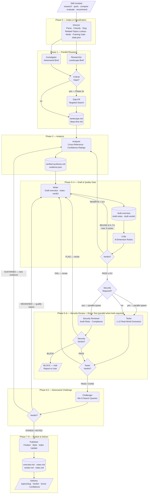
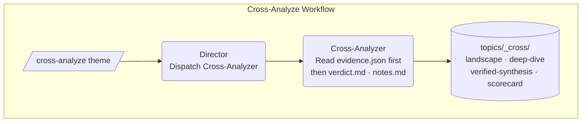
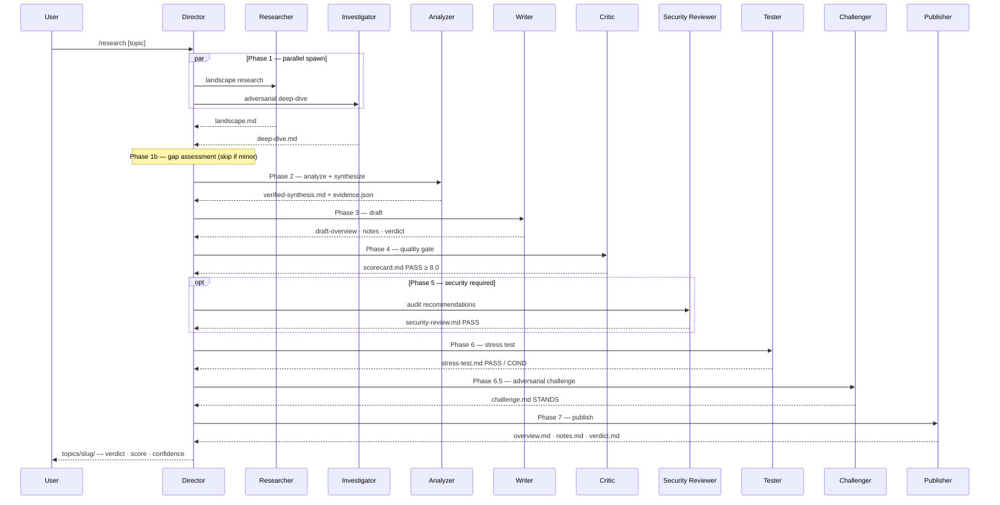

# BrainStorming — Architecture Diagram

Multi-phase research pipeline: skill invocation → 11-phase Director-orchestrated pipeline → published topic files, gated at 8.0/10 quality before publication.

---

## Pipeline Flowchart

---

## Cross-Analyze Workflow

Separate from the research pipeline — no web research. Synthesizes patterns across all existing topic files and writes to `topics/_cross/`.

---

## Agent Handoff — Happy Path

Standard research run showing the turn-by-turn sequence (no revisions, no security block).

